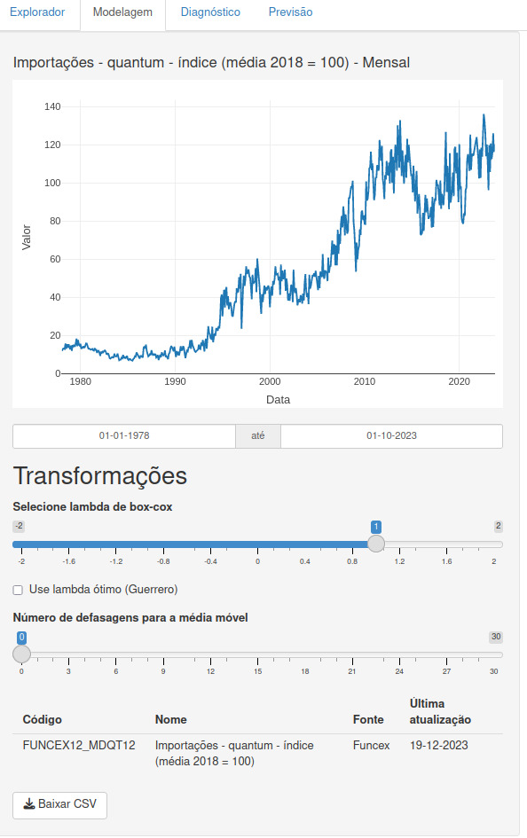
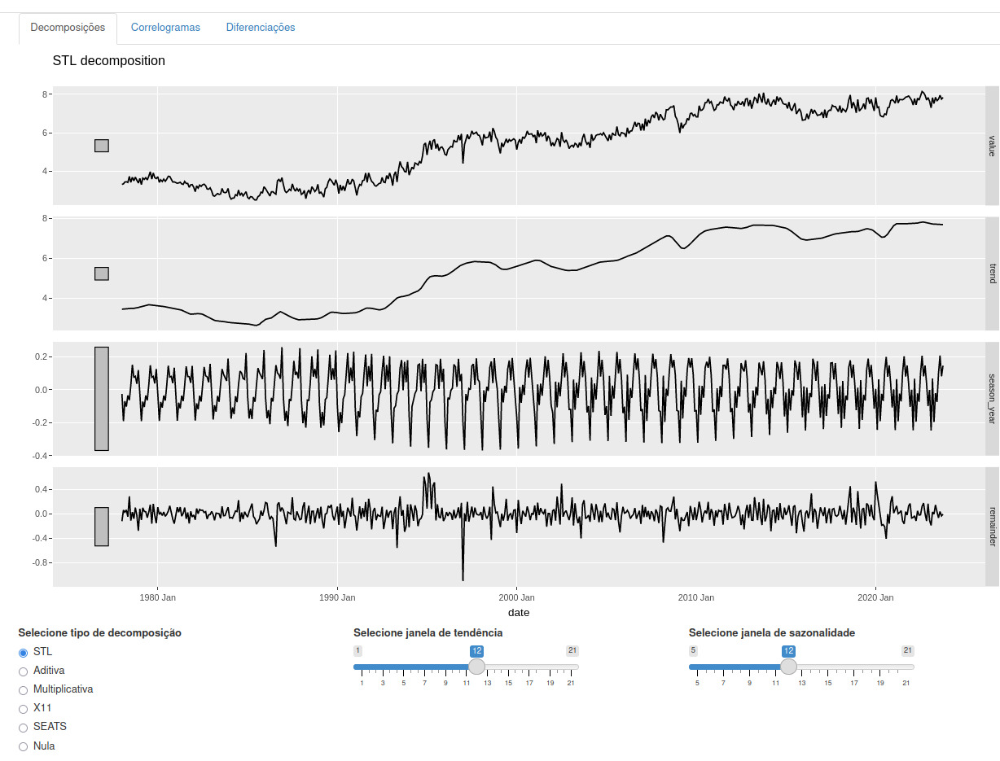
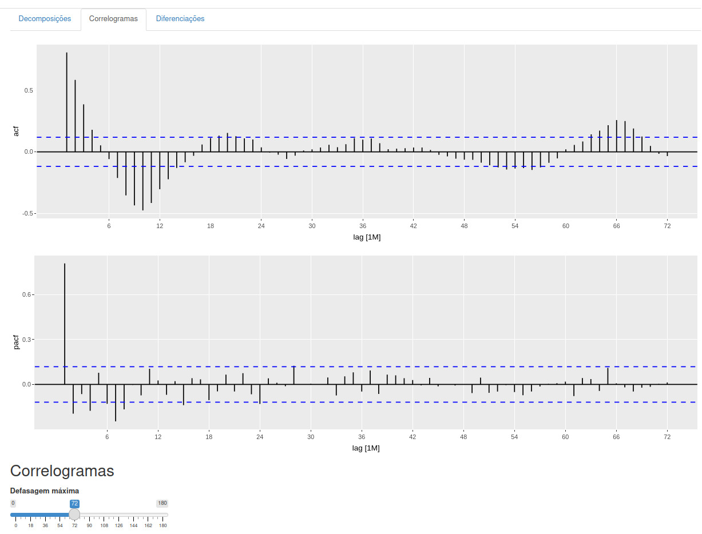
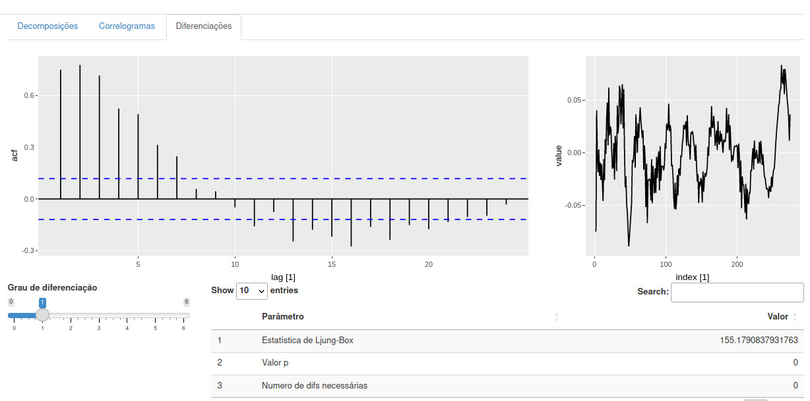

# Modelagem

Na seção de modelagem da plataforma `ipeadatar-shiny`, os usuários podem aplicar transformações e técnicas de decomposição às séries temporais para preparar os dados para a análise e modelagem preditiva. Esta seção é dividida em Transformações, Decomposições, Correlogramas e Diferenciações.

## Transformações

### Transformação de Box-Cox

A transformação de Box-Cox é uma ferramenta estatística amplamente utilizada para estabilizar a variância de uma série temporal. Quando os dados apresentam variação que aumenta ou diminui em função do nível da série, a transformação pode ser extremamente útil.

Diferentes valores de \( \lambda \) na transformação de Box-Cox induzem a transformações comuns, que são aplicadas para normalizar a distribuição dos dados ou estabilizar a variância ao longo do tempo. Aqui estão alguns valores típicos de \( \lambda \) e as transformações correspondentes:

- **\( \lambda = 0 \)**: Log natural (ln) dos dados.
- **\( \lambda = 0.5 \)**: Raiz quadrada dos dados.
- **\( \lambda = -0.5 \)**: Raiz quadrada inversa dos dados.
- **\( \lambda = 1 \)**: Nenhuma transformação é aplicada, mas a série é deslocada para baixo.
- **\( \lambda = 2 \)**: Quadrado dos dados.
- **\( \lambda = -1 \)**: Inversão dos dados.

Para valores de \( \lambda \) diferentes de 0 e 1, a transformação de Box-Cox é definida como:

\[ w_t = \frac{(y_t^\lambda - 1)}{\lambda} \]

onde \( w_t \) são os valores transformados e \( y_t \) são os valores originais da série temporal. A escolha do \( \lambda \) ideal depende da natureza dos dados e do objetivo da análise.

Em geral, é recomendado não usar um valor de \( \lambda \) fora do intervalo de -2 a 2, pois isso pode levar a transformações que distorcem excessivamente a série temporal.

A plataforma `ipeadatar-shiny` permite que os usuários selecionem o valor de \( \lambda \) apropriado para sua análise, proporcionando flexibilidade e controle sobre o processo de transformação dos dados.

### Médias Móveis

O suavizamento por médias móveis é uma forma de estimar o componente tendência-ciclo de uma série temporal, calculando médias dos valores da série dentro de períodos específicos. Isso reduz alguma aleatoriedade nos dados, deixando um componente de tendência-ciclo mais suave.

## Decomposições

A decomposição de séries temporais é uma técnica estatística que desagrega uma série temporal em componentes como tendência, sazonalidade e ruído. Existem dois tipos principais de decomposições: aditiva e multiplicativa.

Baseado no [Capítulo 3 do fpp3](https://otexts.com/fpp3/decomposition.html), a aba de decomposições permite aos usuários decompor uma série temporal em seus componentes essenciais: tendência, sazonalidade e ruído. Utilizando métodos como STL, a plataforma fornece uma forma interativa de visualizar e analisar esses componentes separadamente, oferecendo insights sobre o comportamento da série ao longo do tempo.

### Funcionalidades

- **Seleção do tipo de decomposição**: Escolha entre várias técnicas de decomposição, como STL, aditiva e multiplicativa.
- **Ajuste das janelas**: Configure as janelas de tendência e sazonalidade para refinar a decomposição.
- **Visualização interativa**: Examine os componentes decompostos com gráficos interativos que facilitam a interpretação dos dados.

### Decomposição Aditiva

Na decomposição aditiva, assume-se que os componentes se somam da seguinte forma:

\[ y_t = S_t + T_t + R_t \]

onde \( y_t \) é a observação no tempo \( t \), \( S_t \) é o componente sazonal, \( T_t \) é o componente de tendência-ciclo e \( R_t \) é o componente irregular ou de ruído.

Essa abordagem é mais apropriada quando as flutuações sazonais e a variabilidade em torno da tendência-ciclo são aproximadamente constantes ao longo do tempo.

### Decomposição Multiplicativa

A decomposição multiplicativa considera que os componentes são multiplicativos:

\[ y_t = S_t \times T_t \times R_t \]

Este modelo é adequado quando a amplitude das flutuações sazonais ou a variabilidade em torno da tendência-ciclo parecem ser proporcionais ao nível da série temporal. Uma decomposição multiplicativa pode ser obtida transformando os dados com logaritmos e, em seguida, aplicando uma decomposição aditiva.

### X11

O método X11 é utilizado por agências estatísticas para ajuste sazonal e é baseado em decomposição clássica, mas com várias melhorias, como estimativas de tendência-ciclo para todas as observações e um componente sazonal que pode variar ao longo do tempo.

### SEATS

O SEATS é um procedimento baseado em modelos ARIMA para extração sazonal e é amplamente utilizado por agências governamentais. Ele lida especificamente com dados trimestrais e mensais e não é adequado para outros tipos de sazonalidade.

### STL: Decomposição Sazonal e de Tendência

STL é um método versátil e robusto para decompor séries temporais, que se destaca pela flexibilidade em lidar com diferentes tipos de sazonalidade e pela capacidade de controlar o quão rápido os componentes de tendência-ciclo e sazonal podem mudar. STL é particularmente útil quando a sazonalidade e a tendência variam ao longo do tempo e quando a série contém outliers.

#### Vantagens do STL

- **Manuseio de Sazonalidade Variável**: STL pode lidar com qualquer tipo de sazonalidade, permitindo que o componente sazonal mude ao longo do tempo.
- **Controle do Usuário**: O usuário pode controlar a suavidade da tendência-ciclo e a taxa de mudança da sazonalidade.
- **Robustez a Outliers**: A decomposição pode ser especificada para ser robusta, de modo que observações atípicas não afetem os componentes principais.

#### Desvantagens do STL

- **Variação de Calendário**: STL não lida automaticamente com variações de dias de negociação ou variações de calendário.
- **Decomposições Apenas Aditivas**: Por padrão, STL só realiza decomposições aditivas, mas decomposições multiplicativas podem ser obtidas transformando os dados.

#### Parâmetros Principais

- **Janela de Tendência-Ciclo**: Número de observações consecutivas utilizadas para estimar o componente de tendência-ciclo.
- **Janela Sazonal**: Número de defasagens consecutivas utilizados para estimar cada valor do componente sazonal. Uma janela sazonal infinita força o componente sazonal a ser periódico.

Experimentar com diferentes configurações de janelas permite que o usuário adapte a decomposição às características específicas da série temporal.

### Aprendendo a Usar STL

A melhor maneira de aprender a usar STL é através de exemplos e experimentação com as configurações. Observar decomposições aplicadas a séries reais e ajustar os parâmetros conforme necessário pode fornecer descobertas valiosas e melhorar a capacidade de previsão dos modelos.

Lembrando que a escolha entre decomposição aditiva e multiplicativa — ou um método híbrido usando transformação Box-Cox — dependerá da natureza e das características específicas da série temporal analisada.

## Correlogramas

Os correlogramas, representados pelos gráficos ACF e PACF, são ferramentas cruciais na identificação de valores apropriados para os parâmetros p e q em modelos ARIMA. Enquanto o ACF mede a relação entre \( y_t \) e \( y_{t-k} \) para diferentes valores de k, o PACF mede a relação entre \( y_t \) e \( y_{t-k} \) após remover os efeitos de lags intermediários.

Conforme descrito na [seção de ARIMA não sazonal do fpp3](https://otexts.com/fpp3/non-seasonal-arima.html#acf-and-pacf-plots), nem sempre é possível determinar, apenas por um gráfico temporal, quais valores de p e q são apropriados para os dados. No entanto, muitas vezes é possível usar o gráfico ACF e o gráfico PACF relacionado para determinar valores adequados para p e q.

### Funcionalidades

- **ACF e PACF Plots**: Utilize os gráficos de autocorrelação (ACF) e autocorrelação parcial (PACF) para identificar potenciais valores de p e q para modelos ARIMA.
- **Análise de Autocorrelação**: Entenda a correlação entre observações em diferentes lags, ajudando a identificar a ordem de processos autorregressivos.

## Diferenciações

A diferenciação é uma técnica fundamental para tornar uma série temporal estacionária. Uma série temporal é considerada estacionária quando suas propriedades estatísticas, como média e variância, não dependem do tempo. Séries temporais com tendências ou sazonalidades não são estacionárias, pois esses componentes afetam os valores da série em diferentes momentos.

### O que é uma Série Temporal Estacionária?

Uma série temporal estacionária apresenta propriedades estatísticas consistentes ao longo do tempo. Isso significa que a série não terá padrões previsíveis de longo prazo, e os gráficos temporais mostrarão a série como aproximadamente horizontal, com variância constante. O ruído branco é um exemplo de série temporal estacionária.

### Ciclicidade vs. Estacionariedade

Comportamentos cíclicos em uma série temporal podem ser confundidos com não estacionariedade, mas se os ciclos não têm comprimento fixo e não são previsíveis, a série pode ser estacionária. A diferenciação entre ciclicidade e estacionariedade é importante na análise e modelagem de séries temporais.

### Como Diferenciar uma Série Temporal

Para diferenciar uma série temporal, calculamos as diferenças entre observações consecutivas. Este processo é conhecido como *diferenciação* e é eficaz para estabilizar a média de uma série temporal, removendo alterações em seu nível e, consequentemente, eliminando ou reduzindo tendências e sazonalidades.

### Diferenciação e Transformações

Transformações, como a aplicação de logaritmos, podem ajudar a estabilizar a variância de uma série temporal. Quando combinadas com a diferenciação, estas transformações podem tornar a série temporal tanto estacionária em variância quanto em média.

### Identificando Séries Não Estacionárias

Além do gráfico temporal dos dados, o gráfico da função de autocorrelação (ACF) também é útil para identificar séries temporais não estacionárias. Para uma série estacionária, a ACF diminuirá rapidamente para zero, enquanto a ACF de dados não estacionários decresce lentamente. Além disso, em dados não estacionários, o valor de \( r_1 \) é frequentemente grande e positivo.

Usando a plataforma `ipeadatar-shiny`, os usuários podem aplicar diferenciação às suas séries temporais e visualizar tanto o impacto direto nos dados quanto nos gráficos ACF correspondentes.

Esta aba permite aos usuários aplicarem diferenciações às séries temporais para alcançar estacionariedade, um pré-requisito comum para muitos métodos de modelagem de séries temporais.

### Funcionalidades

- **Aplicação de diferenciações**: Aplique diferenciação simples ou sazonal diretamente na plataforma para analisar o impacto na estacionariedade da série.
- **Visualização dos resultados**: Veja o efeito da diferenciação nas propriedades estatísticas da série e na sua aparência visual.

### Teste de Ljung-Box

Além de examinar o gráfico ACF, podemos realizar um teste mais formal para autocorrelação considerando um conjunto de valores de \( r_k \) como um grupo, em vez de tratá-los separadamente, onde \( r_k \) é a autocorrelação para o lag \( k \). Observar o gráfico ACF à procura de picos fora dos limites implica em múltiplos testes de hipótese, cada um com uma pequena probabilidade de um falso positivo. Com vários testes, é provável que pelo menos um resulte em um falso positivo, levando à conclusão incorreta de que os resíduos têm autocorrelação remanescente.

Para superar esse problema, testamos se as primeiras \( \ell \) autocorrelações são significativamente diferentes do que seria esperado de um processo de ruído branco. Um teste para um grupo de autocorrelações é chamado de teste de portmanteau.

O teste de Ljung-Box é baseado na estatística \( Q^* \), definida como:

\[ Q^* = T(T + 2) \sum_{k=1}^{\ell} \frac{r_k^2}{T - k} \]

onde \( T \) é o número de observações e \( \ell \) é o lag máximo considerado. Se cada \( r_k \) estiver próximo de zero, \( Q^* \) será pequeno. Se alguns valores de \( r_k \) forem grandes (positivos ou negativos), \( Q^* \) será grande. Valores grandes de \( Q^* \) sugerem que as autocorrelações não vêm de uma série de ruído branco.

### Interpretação

Se as autocorrelações viessem de uma série de ruído branco, então \( Q^* \) teria uma distribuição \( \chi^2 \) com \( \ell \) graus de liberdade. Assim, um valor de \( Q^* \) maior que o valor crítico dessa distribuição indica a presença de autocorrelação não explicada pelos modelos.

Cada uma dessas abas equipa o usuário com ferramentas para a realização de uma análise detalhada e a preparação de séries temporais para a modelagem preditiva, seguindo as práticas recomendadas no livro fpp3.
