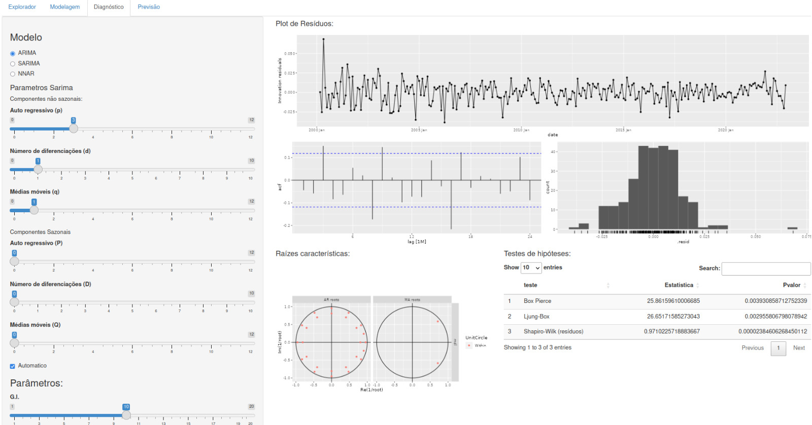

# Modelagem

A modelagem ARIMA (AutoRegressive Integrated Moving Average) é uma abordagem central para a previsão de séries temporais. Ao contrário dos modelos de suavização exponencial que são baseados em uma descrição de tendência e sazonalidade nos dados, os modelos ARIMA visam descrever as autocorrelações nos dados.

## Modelo ARIMA

Um modelo ARIMA combina autoregressão (AR), diferenciação (I - Integrated) e médias móveis (MA). A autoregressão utiliza uma combinação linear dos valores passados da variável para fazer previsões, enquanto que as médias móveis utilizam erros de previsão passados.

A equação geral de um modelo ARIMA é:

$$
\begin{equation}
  (1 - \phi_1 B - \cdots - \phi_p B^p)(1 - B)^d y_{t} = c + (1 + \theta_1 B + \cdots + \theta_q B^q) \varepsilon_t
\end{equation}
$$

onde:
- \( B \) é o operador de defasagem (backshift),
- \( \phi_1, \ldots, \phi_p \) são os parâmetros do componente autoregressivo,
- \( d \) é o número de diferenciações necessárias para tornar a série estacionária,
- \( \theta_1, \ldots, \theta_q \) são os parâmetros do componente de médias móveis,
- \( c \) é uma constante, e
- \( \varepsilon_t \) é o termo de erro (ruído branco).

### Escolhendo os parâmetros \( p \), \( d \), e \( q \)

A seleção dos parâmetros \( p \), \( d \), e \( q \) pode ser desafiadora, mas é fundamental para capturar a estrutura correta dos dados. O valor de \( d \) é determinado pela quantidade de diferenciações necessárias para alcançar a estacionariedade. Os valores de \( p \) e \( q \) são escolhidos com base na autocorrelação e autocorrelação parcial, respectivamente.

## Teste de Ljung-Box

O teste de Ljung-Box é utilizado para verificar se há autocorrelação significativa nos resíduos de um modelo de séries temporais. Valores grandes da estatística \( Q^* \) indicam que as autocorrelações não provêm de uma série de ruído branco.

## Teste de Shapiro-Wilk

O teste de Shapiro-Wilk é usado para avaliar a normalidade dos resíduos. Um valor-p baixo indica que os resíduos não são distribuídos normalmente, o que pode invalidar algumas das suposições dos testes estatísticos realizados.

## Modelo SARIMA

Modelos SARIMA estendem os modelos ARIMA para contabilizar a sazonalidade. Um modelo SARIMA é representado como ARIMA(p,d,q)(P,D,Q)_m, onde a parte não sazonal é ARIMA(p,d,q) e a parte sazonal é (P,D,Q)_m, com m sendo o período sazonal (por exemplo, número de observações por ano).

### ACF/PACF

A parte sazonal de um modelo AR ou MA será vista nos lags sazonais do PACF e ACF. Por exemplo, um modelo ARIMA(0,0,0)(0,0,1)_12 mostrará um pico no lag 12 no ACF, mas nenhum outro pico significativo, enquanto um modelo ARIMA(0,0,0)(1,0,0)_12 mostrará um decaimento exponencial nos lags sazonais do ACF e um pico significativo no lag 12 do PACF.

## Casos Especiais de Modelos ARIMA

Aqui está uma tabela dos casos especiais de modelos ARIMA:

| Modelo | ARIMA |
| ------ | ----- |
| Ruído Branco | ARIMA(0,0,0) sem constante |
| Passeio Aleatório | ARIMA(0,1,0) sem constante |
| Passeio Aleatório com Drift | ARIMA(0,1,0) com constante |
| Autoregressão | ARIMA(p,0,0) |
| Média Móvel | ARIMA(0,0,q) |

## Compreendendo Modelos ARIMA

A função ARIMA() é útil, mas é importante entender o comportamento dos modelos mesmo quando se confia em um procedimento automático para escolher o modelo.

### Efeito da Constante \( c \)

A constante \( c \) tem um efeito importante nas previsões de longo prazo dos modelos:

- Se \( c = 0 \) e \( d = 0 \), as previsões de longo prazo irão para zero.
- Se \( c = 0 \) e \( d = 1 \), as previsões de longo prazo irão para uma constante não nula.
- Se \( c = 0 \) e \( d = 2 \), as previsões de longo prazo seguirão uma linha reta.
- Se \( c \neq 0 \) e \( d = 0 \), as previsões de longo prazo irão para a média dos dados.
- Se \( c \neq 0 \) e \( d = 1 \), as previsões de longo prazo seguirão uma linha reta.
- Se \( c \neq 0 \) e \( d = 2 \), as previsões de longo prazo seguirão uma tendência quadrática (não recomendado e não permitido pelo fable).

### Valor de \( d \)

O valor de \( d \) também afeta os intervalos de previsão — quanto maior o valor de \( d \), mais rapidamente os intervalos de previsão aumentam de tamanho.

### Valor de \( p \)

O valor de \( p \) é importante se os dados mostram ciclos. Para obter previsões cíclicas, é necessário ter \( p \geq 2 \), juntamente com algumas condições adicionais nos parâmetros.

## NNAR

Os modelos de rede neural são métodos de previsão baseados em modelos matemáticos simplificados do cérebro, permitindo relações complexas e não lineares entre a variável de resposta e seus preditores.

### Arquitetura da Rede Neural

Uma rede neural é composta por camadas de "neurônios". Os preditores formam a camada inferior e as previsões a camada superior. Pode haver camadas intermediárias contendo "neurônios ocultos". As redes mais simples, sem camadas ocultas, são equivalentes a regressões lineares.

### Rede Neural Autoregressiva (NNAR)

Em séries temporais, valores defasados da série podem ser usados como entradas para uma rede neural, assim como em um modelo autoregressivo linear. Chamamos isso de modelo NNAR.

Para dados sazonais, valores observados da última temporada também podem ser adicionados às entradas. Por exemplo, um modelo NNAR(p,P,k)_m tem entradas $(y_{t-1}, y_{t-2}, ..., y_{t-p}, y_{t-m}, y_{t-2m}, ..., y_{t-Pm})$ e k neurônios na camada oculta. Um modelo NNAR(p,P,0)_m é equivalente a um modelo ARIMA(p,0,0)(P,0,0)_m, mas sem as restrições nos parâmetros para garantir estacionariedade.

Ao ajustar um modelo NNAR(p,P,k)_m os valores de p e P  especificados, são selecionados automaticamente. Para séries temporais sazonais, os valores padrão são P=1 e p é escolhido com base no modelo linear ótimo ajustado aos dados sazonais ajustados.

### Previsões e Intervalos de Predição

Para previsões, a rede é aplicada iterativamente. Para previsões de um passo à frente, usamos os dados históricos disponíveis. Para dois passos à frente, usamos a previsão de um passo como entrada, juntamente com os dados históricos.

Diferentemente da maioria dos métodos considerados neste livro, as redes neurais não são baseadas em um modelo estocástico bem definido, então não é direto derivar intervalos de predição para as previsões resultantes. No entanto, ainda podemos calcular intervalos de predição usando simulação, onde caminhos de amostra futuros são gerados usando resíduos bootstrap.

Podemos simular iterativamente caminhos de amostra futuros do modelo, gerando aleatoriamente um valor para ε_t, seja de uma distribuição normal ou por reamostragem dos valores históricos. Ao repetir a simulação de caminhos de amostra, construímos o conhecimento da distribuição para todos os valores futuros com base na rede neural ajustada.

## Considerações Finais

Os modelos ARIMA, SARIMA e NNAR representam abordagens poderosas e complementares para a previsão de séries temporais, cada um com suas próprias forças e contextos de aplicação ideais.

### ARIMA

Os modelos ARIMA são adequados para dados não sazonais e são capazes de modelar uma ampla gama de padrões de séries temporais através da autoregressão, diferenciação e médias móveis. Eles são particularmente úteis para descrever e prever séries temporais baseadas em suas próprias observações passadas e erros de previsão passados.

### SARIMA

Os modelos SARIMA estendem os ARIMA para lidar com a sazonalidade, incorporando termos sazonais adicionais. Eles são essenciais para dados com padrões sazonais claros e fornecem um meio de capturar a estrutura sazonal juntamente com as dinâmicas não sazonais.

### NNAR

Os modelos NNAR, baseados em redes neurais artificiais, oferecem uma abordagem não linear para previsões de séries temporais, permitindo relações complexas entre a variável de resposta e seus preditores. Com a inclusão de neurônios ocultos e camadas intermediárias, os NNARs podem capturar padrões e interações que podem ser desafiadores para os modelos lineares.

### Escolha do Modelo

A escolha entre ARIMA, SARIMA e NNAR muitas vezes depende da natureza dos dados e dos padrões observados. Enquanto ARIMA e SARIMA são mais interpretáveis e baseados em modelos estocásticos bem definidos, NNAR pode oferecer uma modelagem mais flexível e capturar dinâmicas complexas que os modelos lineares não conseguem.

### Automação e Compreensão

Embora existam funções automatizadas para selecionar os melhores modelos, é crucial entender o comportamento e as limitações dos modelos escolhidos. A compreensão dos resultados dos diagnósticos, como os testes de Ljung-Box e Shapiro-Wilk, é fundamental para validar os modelos e garantir previsões confiáveis.

### Previsões de Longo Prazo

Cada modelo tem implicações distintas para as previsões de longo prazo e os intervalos de predição. Os modelos ARIMA e SARIMA fornecem uma estrutura para entender como os parâmetros influenciam as previsões futuras, enquanto os NNARs dependem de simulações para gerar intervalos de previsão devido à sua natureza não estocástica.

Em resumo, a escolha e a aplicação cuidadosa dos modelos ARIMA, SARIMA e NNAR podem fornecer insights valiosos e previsões precisas em uma variedade de contextos de séries temporais. A experiência prática com esses modelos e uma compreensão aprofundada de suas capacidades e limitações são essenciais para qualquer analista de séries temporais.

