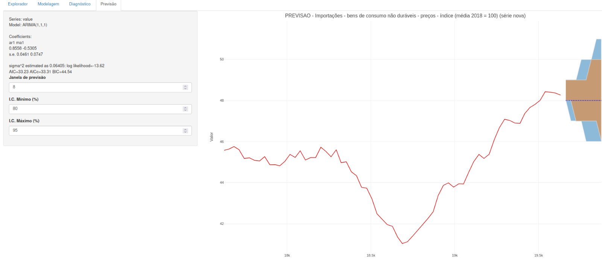

# Previsões

A precisão das previsões em modelos ARIMA, SARIMA e NNAR depende crucialmente do ajuste e da validação adequados dos modelos. Antes de avançarmos para as previsões, é essencial que os modelos estejam bem ajustados e que os resíduos tenham sido submetidos a testes apropriados para autocorrelação e normalidade.

## Previsões Pontuais

Previsões pontuais de modelos ARIMA são calculadas seguindo três etapas:

1. Expanda a equação ARIMA de modo que \( y_t \) esteja à esquerda e todos os outros termos à direita.
2. Reescreva a equação substituindo \( t \) por \( T + h \).
3. No lado direito da equação, substitua futuras observações por suas previsões, futuros erros por zero e erros passados pelos resíduos correspondentes.

Com \( h = 1 \), essas etapas são repetidas para \( h = 2, 3, \ldots \), até que todas as previsões sejam calculadas.

## Intervalos de Previsão

O cálculo dos intervalos de previsão para modelos ARIMA é mais complexo. De forma simplificada, o primeiro intervalo de previsão é calculado utilizando o desvio padrão dos resíduos, \( \hat{\sigma} \), para dar um intervalo de 95% como \( \hat{y}_{T+1|T} \pm 1.96 \hat{\sigma} \).

Para previsões de múltiplos passos em modelos ARIMA(0,0,q), a variância de previsão estimada é \( \hat{\sigma}^2_h = \hat{\sigma}^2 \left[ 1 + \sum_{i=1}^{h-1} \hat{\theta}^2_i \right] \), onde \( h = 2, 3, \ldots \) e \( \hat{\theta}_i = 0 \) para \( i > q \).

Os intervalos de previsão para modelos ARIMA baseiam-se na suposição de que os resíduos são não correlacionados e normalmente distribuídos. Se alguma dessas suposições não for válida, os intervalos de previsão podem ser imprecisos.

## NNAR

Para modelos NNAR, a previsão é um processo iterativo onde os valores históricos e as previsões de um passo são usados como entradas para prever os próximos passos. As redes neurais não se baseiam em um modelo estocástico definido, por isso a geração de intervalos de previsão é feita através de simulação, como discutido anteriormente.

## Utilizando Parâmetros de Previsão no Site

Ao realizar previsões com modelos ARIMA, SARIMA ou NNAR no site, você tem a capacidade de ajustar vários parâmetros que afetam a saída da previsão e como você visualiza os resultados.

### Janela de Previsão

A "Janela de Previsão" refere-se ao número de períodos futuros que você deseja prever. Por exemplo, se você está analisando dados mensais e define a janela de previsão como 8, o modelo gerará previsões para os próximos 8 meses.

### Intervalos de Confiança (I.C.)

Os "Intervalos de Confiança" são usados para expressar a incerteza nas previsões. No site, você pode definir o I.C. mínimo e máximo para visualizar a faixa de possíveis valores futuros que a série temporal pode assumir.

- **I.C. Mínimo (%):** Este é o limite inferior do intervalo de confiança. Um I.C. mínimo de 80% significa que você espera que o valor real esteja acima do limite inferior 80% do tempo.
- **I.C. Máximo (%):** Este é o limite superior do intervalo de confiança. Um I.C. máximo de 95% implica que você espera que o valor real esteja abaixo do limite superior 95% do tempo.

Ajustar esses parâmetros permite que você controle a "largura" dos intervalos de confiança. Intervalos mais amplos refletem maior incerteza nas previsões.

### Gráficos Interativos Plotly

O gráfico de previsão no site é criado usando a biblioteca Plotly, que permite interatividade. Com Plotly, você pode:

- Passar o mouse sobre o gráfico para ver valores específicos.
- Ampliar e reduzir para focar em períodos de tempo específicos.
- Arrastar para mover-se ao longo do eixo do tempo.
- Utilizar as ferramentas de navegação Plotly para personalizar ainda mais a sua visualização.

Essa interatividade ajuda você a entender melhor os padrões de dados e as previsões geradas pelo modelo.

## Conclusão

Os modelos devem ser validados e os diagnósticos devem ser cuidadosamente avaliados antes de confiar nas previsões. A checagem visual dos resíduos, testes estatísticos como Ljung-Box e Shapiro-Wilk, e a validação cruzada são essenciais para garantir que os modelos estejam bem ajustados. Somente depois de um rigoroso processo de diagnóstico e validação, as previsões dos modelos ARIMA, SARIMA e NNAR devem ser utilizadas para inferências e tomada de decisão baseada em dados.

Ajustar a janela de previsão e os intervalos de confiança permite personalizar as previsões para atender às suas necessidades de análise. O uso de gráficos interativos Plotly enriquece a experiência do usuário, proporcionando uma maneira intuitiva e detalhada de explorar previsões de séries temporais. Lembre-se de que um modelo bem ajustado e validado é crucial para gerar previsões confiáveis que possam informar decisões baseadas em dados.
